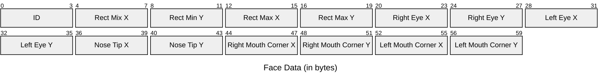

# wasmVision Data

Experimental repo for binary data formats shared by various wasmVision processors.

All data is stored in little-endian format.

## Face

```go
type Data struct {
	ID               uint32
	Rect             types.Rect
	RightEye         types.Size
	LeftEye          types.Size
	NoseTip          types.Size
	RightMouthCorner types.Size
	LeftMouthCorner  types.Size
}
```


